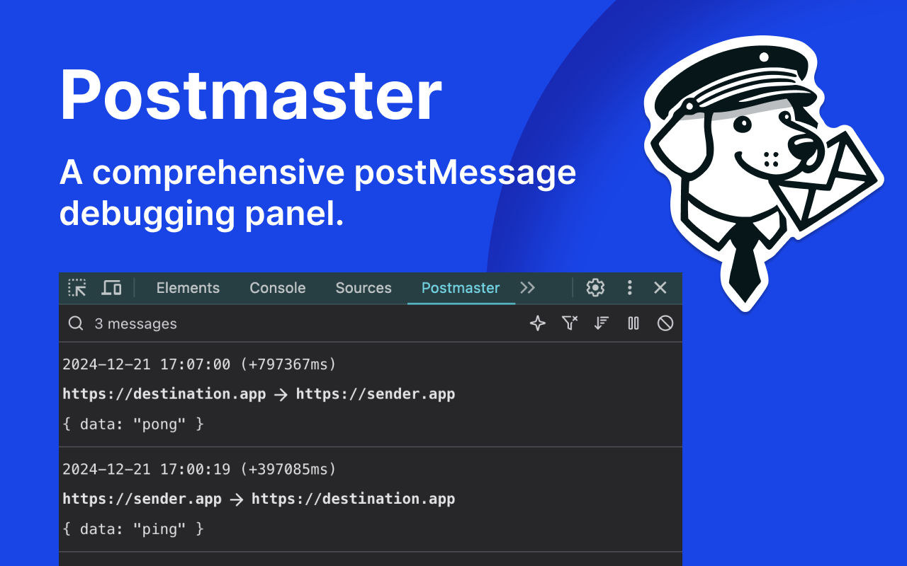

# Postmaster

Chrome extension for an advanced
[postMessage](https://developer.mozilla.org/en-US/docs/Web/API/Window/postMessage)
devtools panel.

 - Supports message logging between windows, iframes, and MessageChannels
 - Includes filtering, searching, sorting, and more. Does not retain or store any data.

Download from the [Chrome web store here](https://chromewebstore.google.com/detail/postmaster/nbbpoelfemohiaghnpmihgemalmcblka): https://chromewebstore.google.com/detail/postmaster/nbbpoelfemohiaghnpmihgemalmcblka

## Local installation:

To use this extension locally:

- Install workspace dependencies with `pnpm install` at the root
- Run the extension locally with `pnpm dev`.
- Navigate to `chrome://extensions` in the browser
- Click "Load Unpacked", then select the `dist` directory of this workspace.

## Acknowledgements

Built using: https://github.com/Jonghakseo/chrome-extension-boilerplate-react-vite

Core mechanism inspired by:
https://github.com/alxHenry/chrome-postMessage-dev-tools
